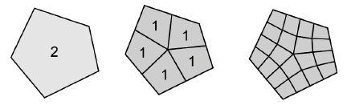

# MeshHAdapt
A Tool for H-Adaptation with Non-Conforming Meshes

The current stage of the codes only deals with initial conforming meshes, returning non-conforming meshes. Each partitioned element in the mesh becomes quadrangles with hanging nodes. The subdivisions are made such as the this: 

As the polygons are subdivided, the refinement degree reduces down to zero.
